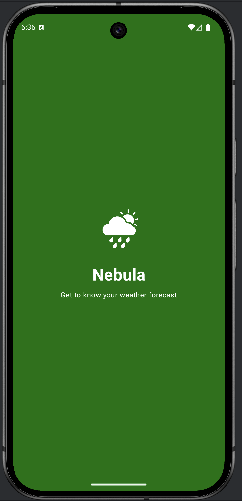
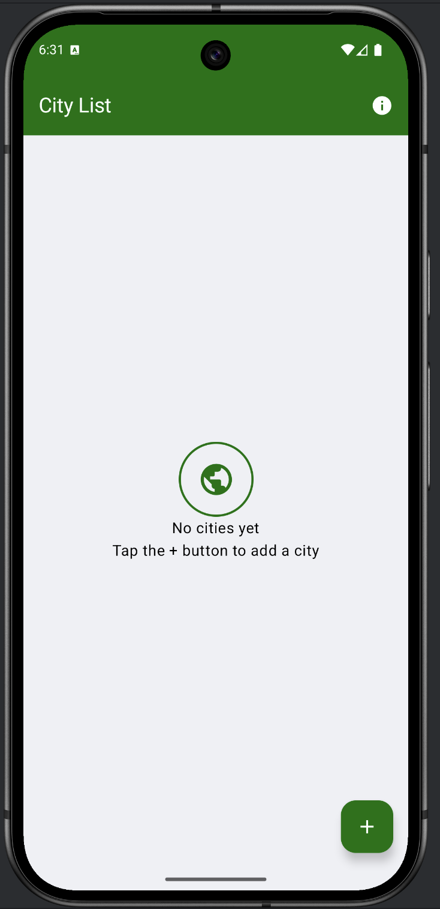
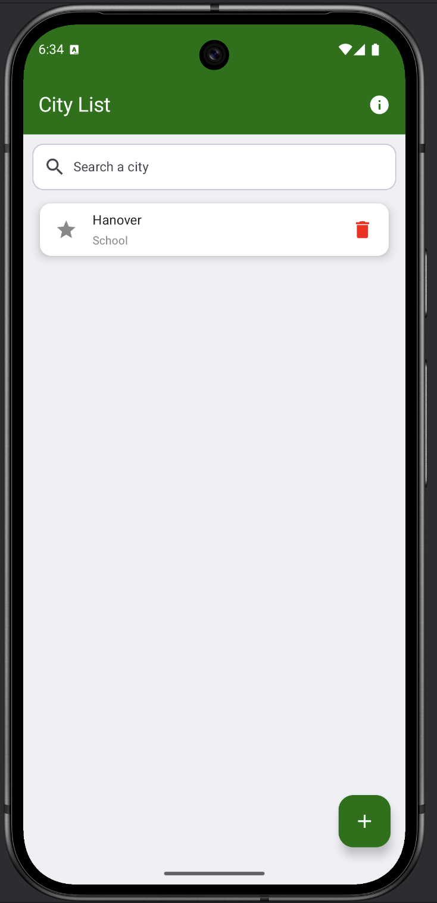
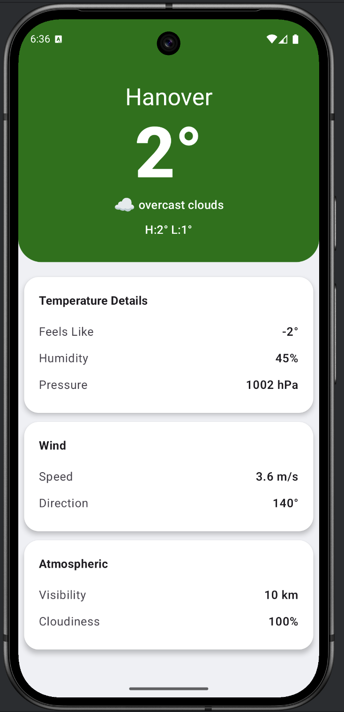
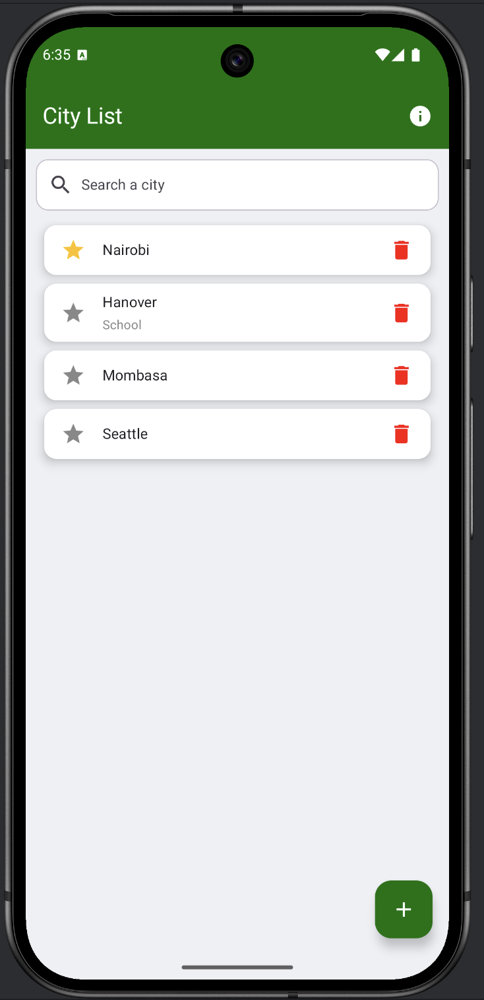
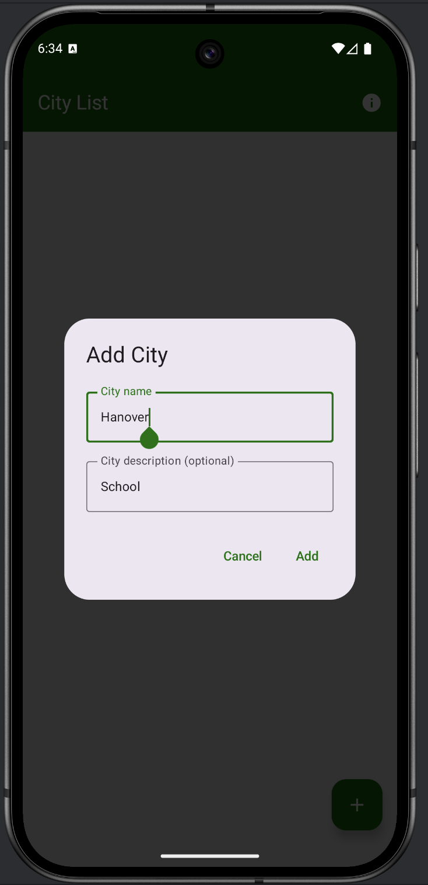
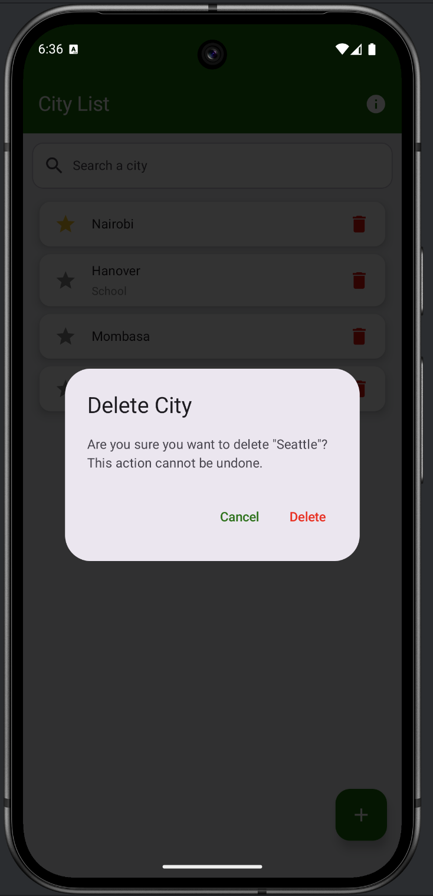

# Nebula
## Screenshots

<div align="center">
  <table>
    <tr>
      <td align="center">
        <br/>
        <b>Splash Screen</b>
      </td>
      <td align="center">
        <br/>
        <b>Empty State</b>
      </td>
      <td align="center">
        <br/>
        <b>Cities Screen</b>
      </td>
    </tr>
    <tr>
      <td align="center">
        <br/>
        <b>Weather Screen</b>
      </td>
      <td align="center">
        <br/>
        <b>Favorites</b>
      </td>
      <td align="center">
        <br/>
        <b>Add City Modal</b>
      </td>
    </tr>
    <tr>
      <td align="center">
        <br/>
        <b>Delete City Modal</b>
      </td>
    </tr>
  </table>
</div>


## Installation
1. Clone the repository:
   ```
   git clone https://github.com/EKasuti/AIT-MobileSoftwareDevelopment.git
   cd WeatherReport
   ```
2. Open the project in Android Studio
3. Build and run the application on an emulator or physical device

## License
This project is part of the Android Development course assignment at AIT.